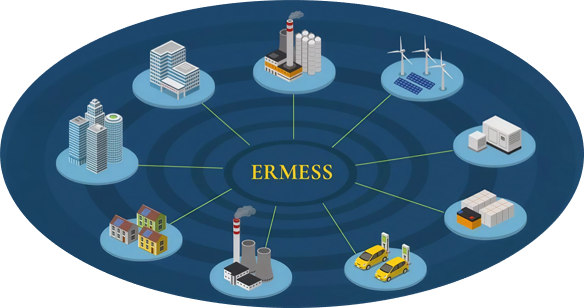

ERMESS
======

Energy system modeling and evolutionary optimization framework

Overview
--------

ERMESS is an open-source evolutionary optimization framework dedicated to the optimal design of energy systems for microgrids, whether isolated or grid-connected.

It enables researchers and engineers to explore complex design spaces under realistic operational constraints, such as minimizing costs, reducing environmental impacts, or ensuring a required level of energy autonomy.

ERMESS supports two complementary optimization approaches:
ERMESS PRO mode, which explicitly models the Energy Management System (EMS), and ERMESS RESEARCH, which directly searches for optimal energy dispatch strategies without requiring an explicit EMS model.

Designed for flexibility and reproducibility, ERMESS provides a powerful environment for investigating, comparing, and optimizing innovative microgrid architectures.

API documentation
-----------------

.. toctree::
   :maxdepth: 2

   api/ERMESS_scripts